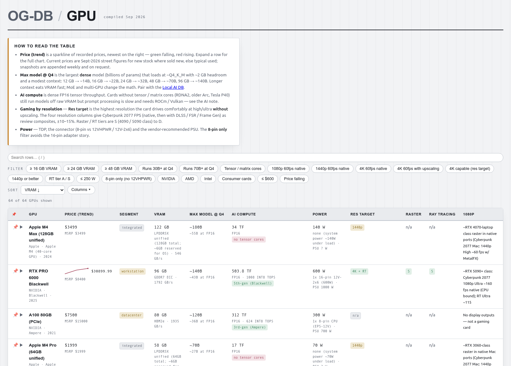

<div align="center">

```
        @@@@@@@@@@@@@        
     @@@@@@@@@@@@@@@@@@@     
   @@@@@@ooooo:ooooo@@@@@@   
  @@@@@oo:::::::::::oo@@@@@  
 @@@@oo:::...###...:::oo@@@@ 
@@@@oo:::...**##....:::oo@@@@
@@@ooo::.....###.....::ooo@@@
@@@oo:::.....###.....:::oo@@@
@@@ oo::.....###.....::oo @@@
@@@@ooo::....###....::ooo@@@@
 @@@@ooo::::.###.::::ooo@@@@ 
  @@@@@oooo:::::::oooo@@@@@  
   @@@@@@ ooooooooo @@@@@@   
     @@@@@@       @@@@@@     
    @@@@@@         @@@@@@    
  @@@@@               @@@@@  
@@@@@                   @@@@@
```

# OmegaGiven

</div>

## Projects

**Live:** [OG TestDesk](#og-testdesk) &middot; [OG-DB](#og-db) &middot; [OG-ai-rpg](#og-ai-rpg) &middot; [3D Modeler](#og-3dmodeler) &middot; [Omega Stories](#omega-stories) &middot; [OG-Note](#og-note) &middot; [go-alias](#go-alias)

**In progress:** [OG-toolkit](#og-toolkit) &middot; [OG-CRM](#og-crm) &middot; [Google-suite replacement](#og-suite)

---

<a id="og-testdesk"></a>

## OG TestDesk — free SQL client + HTTP client + JSON inspector, unified (LIVE)
**Stack:** Rust · [Tauri](https://tauri.app/) (desktop shell) · Svelte/SvelteKit · sqlx (Postgres/MySQL/SQLite) · reqwest · [russh](https://github.com/warp-tech/russh) (pure-Rust SSH)

website: https://omegagiven.github.io/OG-TestDesk/
- https://github.com/OmegaGiven/OG-TestDesk
- Mac App Store: _pending Apple review — link goes here once approved_


Think TablePlus + Postman + a JSON viewer, unified into one free, open-source
desktop app — genuinely free (Apache 2.0, no paywall, no seat licenses) rather
than three separate paid tools that don't talk to each other. Real row editing
(safe UPDATE/INSERT/DELETE with a preview), OAuth 2.0/Digest/AWS SigV4 auth,
pre-request &amp; test scripts, a cookie jar, a local mock server, WebSocket
and gRPC testing — and a local MCP server built in from the ground up, so an
AI assistant can query, request, and open tabs directly, behind explicit flags
you control, nothing reachable by default.

---

<a id="og-db"></a>

## OG-DB — buyers-guide reference databases (LIVE)
**Stack:** static HTML/CSS/JS (no framework, no build step) · a small Node generator · GitHub Pages

website: https://omegagiven.github.io/OG-DB/
- https://github.com/OmegaGiven/OG-DB



Thirteen hand-built comparison databases &mdash; GPUs, laptops, phones, local AI
models, robot vacuums, smart glasses, headsets, mechanical keyboards, mice, and
RAM / SSD / HDD &mdash; each one a single self-contained page with filtering,
multi-column sort, show/hide columns, row-pinning, expandable detail rows, and a
source link on every row. The storage DBs track street price over time with
inline sparkline charts. Built because every &ldquo;best X&rdquo; article is SEO
filler and affiliate bait; this is just the specs that actually decide a
purchase, in a table you can sort.

## OG-OS — Arch + Sway + Propritary Operating System Ive built and daily drive

**Stack:** Rust · [Iced](https://iced.rs/) (GUI) · shared crates (og-config, og-theme, og-wayland) · Wayland/Sway · Axum, zbus, D-Bus for system services

A full desktop application suite, not a pile of dotfiles — a settings app,
app store, file manager, launcher, notification system, and (next) a
taskbar, all built from the same shared foundation instead of being
independent projects duct-taped together. Everything matches every other
Linux desktop tool feature-for-feature, and where the popular defaults
(waybar, most file managers) hit a wall, this suite goes further instead
of accepting the limitation.


**[OG-toolkit](https://github.com/OmegaGiven/OG-toolkit)** — the shared
crates every app is built on: one config schema, one theming engine, and
a shared Wayland integration layer, so the whole suite reskins itself
from a single place and every app gets new capability the moment the
shared layer gets it.

**The apps**, each its own repo, each part of the same suite:
- [og-settings](https://github.com/OmegaGiven/sway-settings-manager) — the whole suite's control panel
- [og-apps](https://github.com/OmegaGiven/linux-packages) — pacman/AUR/Flatpak store
- [og-files](https://github.com/OmegaGiven/OG-file-manager) — file manager
- [og-search](https://github.com/OmegaGiven/OG-system-search) — app launcher / instant shortcuts
- [og-notify](https://github.com/OmegaGiven/OG-notify) — themed notification effects system
- [og-links](https://github.com/OmegaGiven/OG-links) — local shortcut redirect service

**Next up: [og-bar](https://github.com/OmegaGiven/OG-bar)** — a taskbar to
replace waybar, matching everything it does and fixing what it can't.

Desktop: Sway · OS: Arch Linux

<a id="og-3dmodeler"></a>

## My specific object 3d modeler (LIVE)
**Stack:** TypeScript · React · Vite · [three.js](https://threejs.org/) (3D/CSG) · Konva (2D canvas)

website: https://omegagiven.github.io/OG-3dmodeler/ 
- https://github.com/OmegaGiven/OG-3dmodeler


<a id="omega-stories"></a>

## Where I write my stories and such as I love writing Fantasy short stories (LIVE)
**Stack:** [Hugo](https://gohugo.io/) (static site generator) · HTML/CSS/JS themes

website: https://omegagiven.github.io/omega-stories/
- https://github.com/OmegaGiven/omega-stories


<a id="og-note"></a>

## OG-Note A Rich Text Editor that has all the features i wish other note apps
**Stack:** Svelte · TypeScript · HTML/CSS · [Tauri](https://tauri.app/) (desktop shell, native Kotlin/Swift mobile shims) · [Tiptap](https://tiptap.dev/) (editor) · Yjs (CRDT sync)

website: https://omegagiven.github.io/OG-note/
- https://github.com/OmegaGiven/OG-note


<a id="og-crm"></a>

## CRM tool for small businesses (BETA Testing stage)
**Stack:** TypeScript · JavaScript · HTML · [NestJS](https://nestjs.com/) + Prisma (backend, Postgres via Supabase) · React Native / [Expo](https://expo.dev/) (mobile)

- https://github.com/OmegaGiven/OG-fulfillment

<a id="og-suite"></a>

## Trying to build a suite to replace googles suite of software (WIP)
**Stack:**
- v1 — Rust + [Axum](https://github.com/tokio-rs/axum) (server, Postgres) · TypeScript · React (React Native/Expo, mobile) · Loro (CRDT sync)
- v2 — Rust + Axum (backend, Postgres) · Svelte/SvelteKit · TypeScript · JavaScript · HTML/CSS · [Tauri](https://tauri.app/) (desktop/mobile shell for the audio and notes apps, native Kotlin/Swift shims)

- v1: https://github.com/OmegaGiven/home-suite-home
- v2: https://github.com/OmegaGiven/OG-suite

<a id="go-alias"></a>

## Go alias service (LIVE)
**Stack:** Rust · [actix-web](https://actix.rs/)

- https://github.com/OmegaGiven/go-alias-rust
